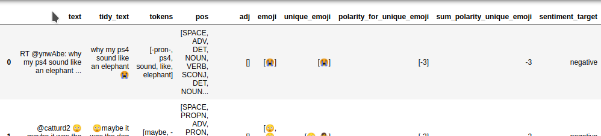
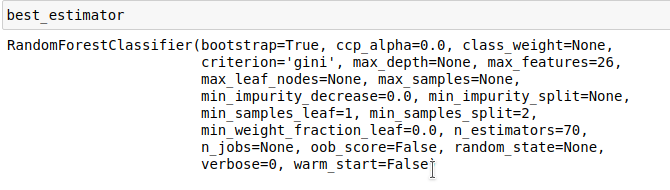
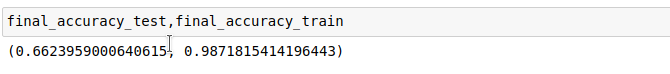

# sentiment-analysis-of-tweets-using-emoticons
In this project I downloaded tweets (Thython) and I semilabeled them using emojis.
I used a table with polarity for every emoji and calculated sum of polarity for unique emojis for every tweet. 
Using this information I grouped emojis in two groups (positive/negative). 
I used TfidfVectorizer() and average_tweet_vectorizer() to prepare the features.

## Download data for experiment

Data used for the experiment: 
https://drive.google.com/file/d/1-7yg9HrAqtFvP5K5r35yKThiXKxZaVco/view?usp=sharing

 

## Download new data with your own criteria
Before using 'tweets_scraper.py' visit https://stackabuse.com/accessing-the-twitter-api-with-python/ 
and read 'Getting Credentials' part. 
To use consumer key/secret to authenticate the app you need to save credentials in ./acces_key/access.json

    {"CONSUMER_KEY": "key 1",
    
    "CONSUMER_SECRET": "key 2",
    
    "ACCESS_TOKEN": "key 3",
    
    "ACCESS_SECRET": "key 4"}

To download new data use './tweets_scraper.py'
You can change the query and language for searching tweets.
To set number of download tweets use 'range_number,tweets_number_for_every_range' parameters

## Data preprocessing and model training

To do data preprocessing and model training use "data_preprocessing_model_training.py"

#### Create features and target

 
 

 
## What should I install

All needed libraries are to find in 'requirements.txt' file.
 