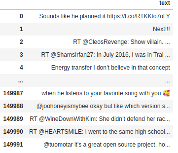

# sentiment-analysis-of-tweets-using-emoticons
The main purpose of this project was to develop a model that would predict emotions of Twitter users based on the emojis they used. 
The data has been downloaded using Thython API. Then the tweets were semilabeled using emojis.
The tabel with polarity for every emoji was used and sum of polarity for unique emojis for every tweet was calculated. 
Using sum of polarity the data was divided in two groups (positive/negative). 
TfidfVectorizer() and average_tweet_vectorizer() was used to prepare the features.

## Results
First experiment with different classifier showed that the best results for balanced dataset was achieved with Random Forest Classifier.
 In this case an **accuracy was 0.66** for two classes. Ideas for improving the score are available.
 
## Navigate this repository
- Before starting the project please set up your local environment and install [**requirements**](requirements.txt)
- **Data used for the experiment**: [Download raw data](https://drive.google.com/file/d/1-7yg9HrAqtFvP5K5r35yKThiXKxZaVco/view?usp=sharing) 

 
- Before you [**download new data**](src/tweets_scraper.py) with your own criteria please visit [Stackabuse Page](https://stackabuse.com/accessing-the-twitter-api-with-python/) 
and read **Getting Credentials** part. 
To use consumer key/secret to authenticate the app you need to save credentials to `acces.json` file in [following location.](acces_key/access.json)

    ```
  {"CONSUMER_KEY": "key 1",
    
    "CONSUMER_SECRET": "key 2",
    
    "ACCESS_TOKEN": "key 3",
    
    "ACCESS_SECRET": "key 4"} ``` 
- For preprocessing use [Data preprocessing](src/data_preprocessing.py) file.
- For modeling use [Model training](src/model_training.py) file.
- My model you can find on [Google Drive](https://drive.google.com/file/d/1OKG79fGBUrHgc9ErpQkwZCQGGrnbv2zC/view?usp=sharing). Your model will be saved [here](models/).
- All plots you can find/save [here.](raports/figures)


 